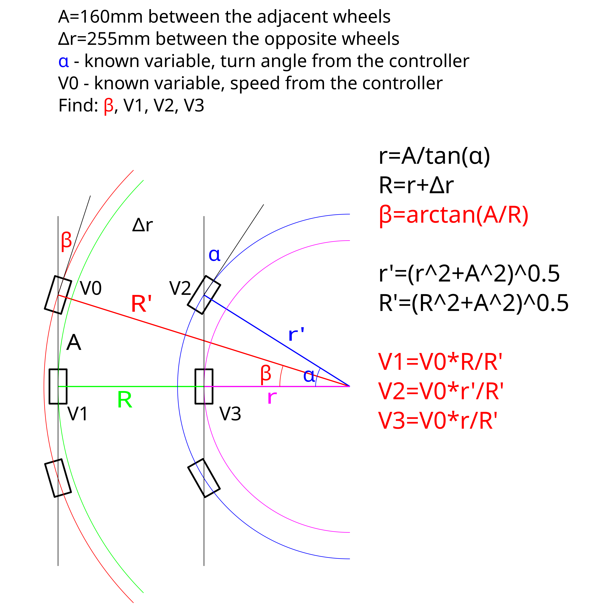

# Tyr project

## "Car mode" turn calculations

## On RPI5

- [Main controlling program](tyr_controller.py)
- the auto start services are in: *~/.config/systemd/user/*
  - btcont.service enabled by using: *systemctl --user enable btcont*
  - tyr.service enabled by using: *systemctl --user enable tyr*

## On motor2040

- [Motor controlling script](code.py)

**The Gamepad must be in connecting mode before booting the RPI**

## Controls

- Left stick Right/Left to make turn
- Right stick Up/Down to move Forward/Backward
- X button to switch between Car/Parallel modes
- O button to switch the Rover mode on/off
